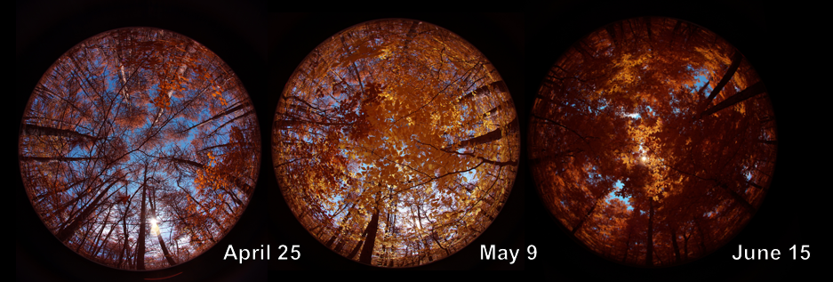

***
#Canopy Structural Complexity

  
Canopy structure, an ecosystem feature that can be broadly characterized using remote sensing technologies,is a well-established determinant of forest carbon storage, with the quantity of canopy leaves a universal predictor of carbon storage. But the arrangement of leaves in the canopy, rather than just the volume, may provide unique, complementary information about the underlying biological controls on forest carbon storage. Thus, coordinated measurements of both leaf quantity and arrangement within the canopies of a diverse array of forests may lead to substantially improved modeled estimates of carbon storage by the Nation's forests. My work uses sites from the National Ecological Observatory Network (NEON) to evaluate whether canopy structural complexity, or the spatial variability in leaf arrangement within a canopy, is a global predictor of forest carbon storage within and across sites varying in physical structure, species composition and diversity, and climate.  

***
#Moderate Disturbance

I am also working with a team of core researchers focused on assessing how forest structure changes with moderate disturbance (e.g. ice, fire, insects, pathogens) across an array of sites including Hubbard Brook Experimental Forest, University of Michigan Biological Station, and the Great Smoky Mountains National Park.  

Various disturbances agents leave unique structural signatures. Ice storms remove more vegetation in the upper canopy, while beech bark disease creates isolated deep gaps. Through using terrestrial lidar, these signatures can be identified and their ecololgical impacts can then be tested. 

[Hubbard Brook Experimental Forest Ice Storm Experiment](https://www.nrs.fs.fed.us/sustaining_forests/natural_disturbance/ice_storm_experiment/)  
[University of Michigan Biological Station](https://lsa.umich.edu/umbs)

***
#Novel Remote Sensing Methods

New and novel means of remotely sensing the environment are creating new and exciting opportunities in ecology and across the earth sciences. In my work I am using a combination of multiple terrestrial based remote sensing platforms: hemispherical NDVI cameras to monitor plant greenness and phenology; terrestrial 2D and 3D lidar units to measure quantify ecological structure, sensor arrays to monitor soil moisture, as well as some work with UAV/terrestrial data fusion.

#Shenandoah Watershed Study

    
I have also worked with the [Shenandoah Watershed Study and Virginia Trout Stream Sensitivity Study](http://people.virginia.edu/~swas/POST/scripts/overview.php), a monitoring and research program focused on understanding the biogeochemistry of mountain headwater streams in Virginia, West Virginia, and Maryland--including Shenandoah National Park and other public lands.

***
